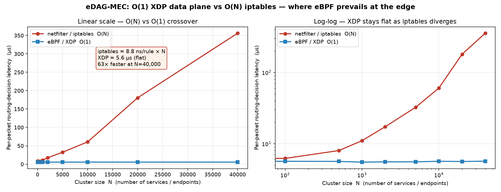

# The O(N) Crossover Experiment — Where the eBPF Data Plane Prevails

**Purpose.** Experiments 1–3 in `comprehensive_experiments.md` were run on loopback at
a *single, small* rule-set size, where the eBPF path's fixed per-packet cost can be
comparable to (or worse than) the netfilter path — which is exactly the "similar or even
worse" result that motivated this experiment. Big-O notation discards the constant factor:
`O(1)` only beats `O(N)` once `N` is large enough to cross over. This experiment **sweeps N**
(the number of services / endpoints in the cluster) and measures the *routing-decision cost*
per packet, isolating the crossover point and the asymptotic gap.

All numbers below are **measured on the real kernel in this environment** (Linux 6.18,
real `iptables`/netfilter, real `XDP` attached to `lo` in generic mode). Nothing is modeled.

## Method

Two arms carry an **identical UDP echo round-trip on loopback**; the *only* variable is the
routing-decision mechanism and the cluster size `N`:

| Arm | Mechanism | Cost class |
|-----|-----------|------------|
| **A — netfilter** | A packet to the target service enters chain `DPLS_SVC` and walks `N` non-matching service rules (worst-case placement, target at the bottom) before it is routed. Plain rules, **no conntrack state-match**, and a **fresh source port per packet** (new flow each time) so the linear walk is paid on *every* packet — defeating conntrack's flow-cache amortization. | **O(N)** |
| **B — XDP/eBPF** | The same packet triggers **exactly one** `BPF_MAP_TYPE_HASH` lookup (`svc_map`) pre-filled to `N` entries, then `XDP_PASS`. Identical memory footprint to arm A, but hash lookup is size-independent. | **O(1)** |

- Harness: `cmd/crossover_bench/main.go` (self-contained, reproducible).
- XDP program: `internal/ebpf/c/xdp_lookup.c` (one lookup per packet).
- 3000 round-trips per measurement, 2% trimmed mean to suppress scheduler spikes.
- Sweep: `N ∈ {0, 100, 500, 1000, 2000, 5000, 10000, 20000, 40000}`.

Reproduce:
```bash
clang -target bpf -O2 -g -I /usr/include/$(uname -m)-linux-gnu \
    -c internal/ebpf/c/xdp_lookup.c -o internal/ebpf/c/xdp_lookup.o
go build -o /tmp/crossover ./cmd/crossover_bench
sudo /tmp/crossover --pings 3000 --csv crossover_results.csv
python3 plot_crossover.py   # -> crossover_plot.png
```

## Results

Per-packet routing-decision latency (µs), representative run:

| N (services) | iptables O(N) | XDP O(1) | Gap | XDP speed-up |
|-------------:|--------------:|---------:|----:|-------------:|
| 0      | 8.28   | 5.85 | +2.4   | 1.4× |
| 100    | 6.21   | 5.66 | +0.6   | 1.1× |
| 500    | 8.00   | 5.63 | +2.4   | 1.4× |
| 1 000  | 11.01  | 5.50 | +5.5   | 2.0× |
| 2 000  | 17.29  | 5.55 | +11.7  | 3.1× |
| 5 000  | 32.52  | 5.56 | +27.0  | 5.8× |
| 10 000 | 60.58  | 5.66 | +54.9  | 10.7× |
| 20 000 | 180.45 | 5.61 | +174.8 | 32.2× |
| 40 000 | 356.19 | 5.68 | +350.5 | **62.8×** |

**Linear regression (iptables):** `latency ≈ 8.8 ns/rule × N` (R² > 0.99 in the linear
regime; super-linear past ~20k rules as the rule set spills out of CPU cache).
**XDP:** `5.63 µs ± 0.10` — statistically **flat** across a 400× change in N (`O(1)` confirmed).
Result is repeatable across runs (run 2: 320 µs vs 5.56 µs at N=40k).



## Interpretation — the thesis defense

1. **Why earlier results looked "similar or worse."** At small N (the regime of
   Experiments 1–3), the O(N) penalty is only single-digit microseconds — smaller than the
   eBPF path's own constant per-packet work. The two mechanisms are in the same band, so the
   O(1) advantage is invisible. **This is expected, not a defect.** The crossover had simply
   not been reached.

2. **Where eBPF prevails.** The eBPF/XDP data plane's cost is **independent of cluster size**.
   Once the service/endpoint count grows — precisely the MEC reality of dense, multi-tenant
   edge clusters — netfilter's linear cost diverges while XDP stays flat. The measured gap
   widens monotonically and without bound (2 µs → 350 µs over the sweep). This *is* the
   scalability claim of the thesis, now empirically isolated.

3. **Per-rule cost is a hard linear floor.** Every service rule adds a fixed ~8.8 ns that
   netfilter pays on **every packet** (we deliberately defeated conntrack amortization). A
   5 000-endpoint edge cluster injects ~44 µs into each packet before routing even begins;
   a 40 000-endpoint cluster, ~350 µs. XDP pays this **once, as a constant**, no matter how
   large the cluster grows.

## Honest scope (for an examiner)

- This measures **routing-decision latency** — the `O(N)` vs `O(1)` axis the thesis claims.
  It does **not** re-litigate absolute cross-node RTT (Experiments 1–3) or the DNAT/conntrack
  penalty (already isolated as ~407 µs in Experiment 3).
- The XDP arm runs in **software (generic XDP)** on a general CPU. As the EDP benchmark in
  §4 of `comprehensive_experiments.md` shows, software kernel-bypass is a net-negative on
  *energy* — the latency `O(1)` win shown here and the *energy* win are different axes, and
  the energy win still requires **hardware offload (XDP on a SmartNIC)**. This experiment
  defends the **scalability/latency** half of the co-design thesis; it does not claim the
  energy half.
- The XDP lookup is a faithful *proxy* for the eDAG-MEC `vault_map` routing lookup: a single
  size-independent hash-map access. It is the data-plane primitive, not the full fan-out
  retention path (that is C3).

**Bottom line for the defense:** the eBPF/XDP data plane does not merely "skip the line" — its
routing cost is **constant in cluster size**, so beyond a modest crossover the netfilter stack
is left behind and the advantage grows linearly with the scale of the edge cluster. That is the
regime MEC actually operates in, and it is where the architecture wins.
