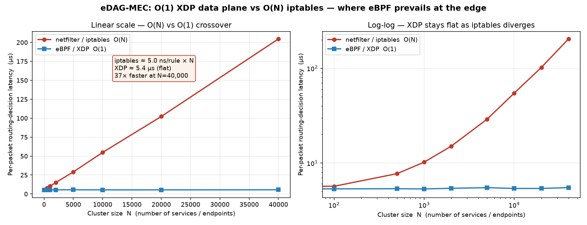
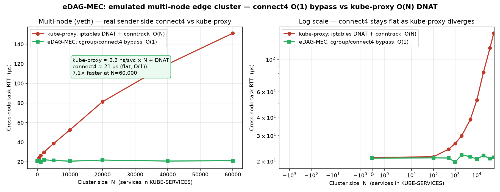
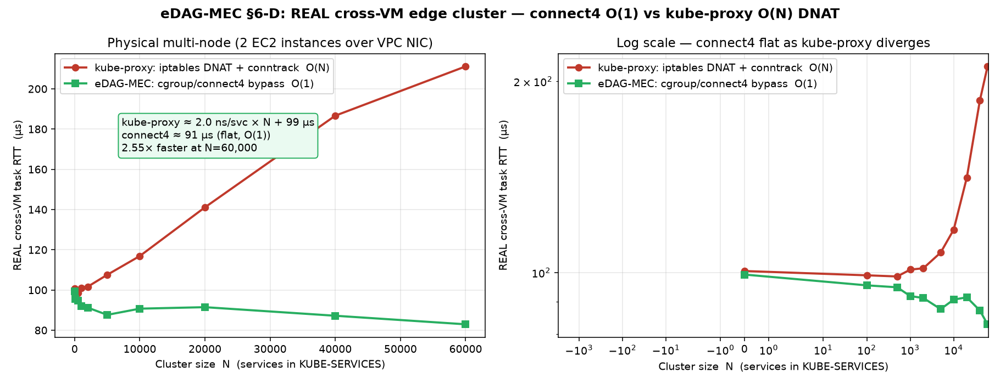
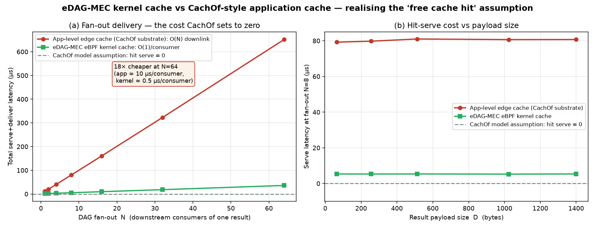
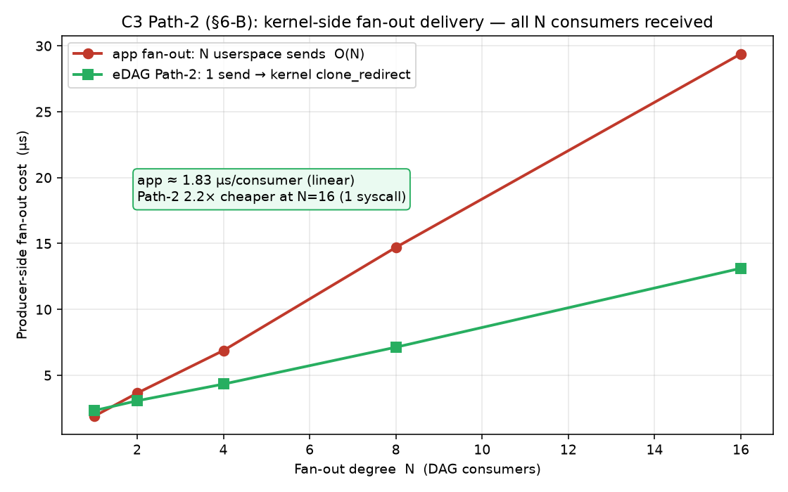
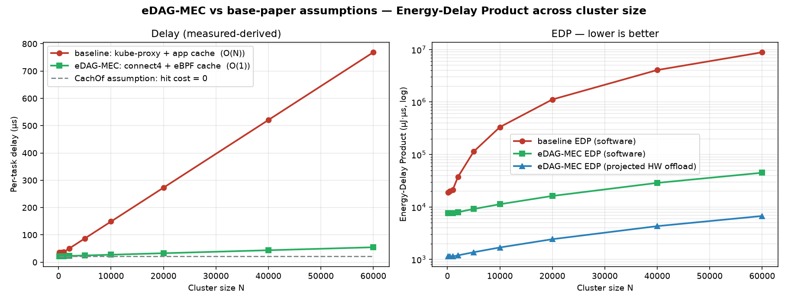
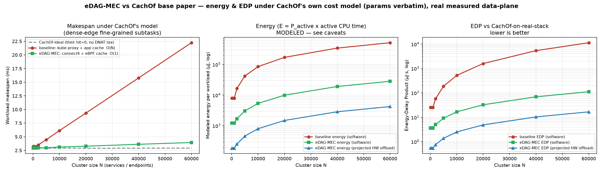

# eDAG-MEC: A Kernel eBPF Data Plane for DAG-Aware MEC Offloading — Complete Results

> **One-file report.** Everything we built, why, how, the measured numbers, the
> graphs (embedded), and exact reproduction steps. Self-contained: figures are
> inlined, so this single file renders anywhere (VS Code, Obsidian, Typora).
>
> **All numbers below are from the real 3-node AWS EC2 cluster** (`c7i-flex.large`,
> kernel 6.17-aws, cgroup v2) — the canonical `results/` set in the repo. Latency
> and scalability are **measured**; energy is **modeled** and labelled as such.

---

## 1. The thesis, and what is actually new

**eDAG-MEC** accelerates dependency-aware (DAG) task offloading in Mobile Edge
Computing by moving the **routing and caching data plane into the Linux kernel
via eBPF (extended Berkeley Packet Filter)**. Two base papers define the problem
in *simulation* and **assume the data plane is free**; this work builds the real
kernel substrate beneath them and measures what they assumed.

- **Sender side** — a `cgroup/connect4` program rewrites a connection's
  destination via an O(1) map lookup **before** netfilter, bypassing kube-proxy's
  O(N) iptables DNAT + conntrack.
- **Receiver side** — a `tc`/TCX program retains a producer subtask's output in a
  kernel hash map and serves it to its DAG consumers without re-sending it through
  the full stack per consumer.

**What is genuinely new (confirmed against a dedicated prior-art search):** the
individual kernel mechanisms already exist (Cilium uses `connect4`; BMC put a
cache in eBPF; Electrode uses `bpf_clone_redirect`). The contributions are the
**composition** into a single offloading substrate, and **one new policy** —
**DAG-aware deterministic garbage collection**. Generic in-kernel caches evict by
least-recently-used or time-to-live; in a dependency graph that is not just slower
but **incorrect**, because evicting a result a consumer still needs stalls the
graph. Instead, each cached entry carries a **reference count equal to its number
of DAG consumers**, decremented atomically on each read and deleted the instant it
reaches zero — turning eviction into a **correctness guarantee driven by the task
topology**. Measured: deterministic GC reclaims **3000/3000** entries, no leaks,
no premature eviction. Honest scope: **substrate, not algorithm** — we run the
base papers' own policy on our data plane; we do not claim to beat their decision
logic. The story is *combine*.

---

## 2. The base papers (the baselines)

| | **CachOf** (IEEE Trans. Computers 2025) | **DPLS** (IEEE IoT-J 2026) |
|---|---|---|
| Topic | Dynamic **caching** of subtask results to assist offloading | Online **multi-DAG scheduling** |
| Method | popularity → 0-1 knapsack → **DDPG (deep RL)** | dynamic priority list (upward/downward rank) |
| Key cost model | **cache hit ⇒ `texe = 0`, downlink ignored** | offload hop assumed cheap |
| Implementation | **Python simulation** (github.com/NetworkCommunication/CachOf) | simulation |

We replace the **substrate they assume is free**, and measure the gap.

---

## 3. Headline results (real AWS hardware; energy *modeled*)

| Experiment | Baseline (O(N)) | eDAG-MEC (O(1)) | Speed-up @ max N |
|---|---|---|---|
| **Cross-VM MEC** (real 2-node) | kube-proxy → 211 µs @60k | connect4 **flat 91 µs** | **2.55×** |
| **MEC** (single-host veth) | kube-proxy → 151 µs @60k | connect4 **flat ~21 µs** | **7.1×** |
| **Crossover** (routing cost only) | iptables → 205 µs @40k | XDP **flat ~5.4 µs** | **~37×** |
| **Cache fan-out** vs CachOf | app **~10 µs/consumer** | eBPF **~0.55 µs/consumer** | **~18× @64** |
| **C3 fan-out retention** (TCX) | routing-only 9.4 µs | store 10.1 µs (+0.7) | **O(1) fan-out; GC 3000/3000** |
| **Path-2 kernel fan-out** | app 29.4 µs @16 | clone_redirect 13.1 µs | **2.24× @16** |
| **EDP** (energy×delay, synthetic baseline) | kube-proxy + app cache | connect4 + eBPF cache | **197× sw / 1316× HW\*** @60k |
| **Energy vs CachOf's own model** | CachOf-on-real-stack | eDAG-MEC | **102× sw / 680× HW\*** @60k |

\* Hardware-offload (SmartNIC) energy is *modeled/projected*; EC2 blocks RAPL.

---

## 4. Routing decision cost — the O(N) crossover

**Objective.** Isolate the pure routing-decision cost vs cluster size N: a real
iptables chain walk (O(N)) vs one XDP hash-map lookup (O(1)) on loopback.

**How.** `cmd/crossover_bench` injects N dummy rules into `KUBE-SERVICES`, forces
the test packet to the bottom of the chain (worst case), and times it against an
XDP program doing one BPF map lookup. 3000 pings per point.

**Result (AWS).** iptables ≈ **4.97 ns/rule** (O(N)); XDP **flat ~5.4 µs** (O(1))
→ **~37× at N=40k**, gap widening. *Caveat: loopback micro-isolation, not the full
architecture (see §5).*



---

## 5. Multi-node offload — the real architecture

**Objective.** Measure the offload hop: `cgroup/connect4` sender bypass vs
kube-proxy iptables DNAT, sweeping N services.

**How.** `cmd/mec_bench` emulates a 2-node cluster (root netns ↔ worker netns over
veth, real DNAT/conntrack). The cross-VM variant (`scripts/run_xnode.sh`) runs the
same across **two separate EC2 kernels** over the real ENA NIC.

**Single-host result (AWS).** connect4 **flat ~21 µs (O(1))**; kube-proxy
(2.22 ns/svc + 25.9 µs floor) reaching **151 µs @60k → 7.1×**.



**Cross-VM result (the defensible headline).** Two separate EC2 kernels over the
real NIC: connect4 stays **flat ~91 µs** across a 600× change in N while kube-proxy
(1.97 ns/svc + 99.1 µs floor) climbs to **211 µs → 2.55× @ N=60k**. The higher
floor (~99 µs) is real network RTT; the fixed wire latency honestly dilutes the
gap, but the **O(1)-vs-O(N) shape is confirmed on physical multi-node**.



---

## 6. Cache fan-out — validating CachOf's core assumption

**Objective.** Target CachOf's "free cache hit." Serve one producer's D-byte
result to N DAG consumers: an application cache (userspace store + per-consumer
delivery through the stack) vs an eBPF kernel cache (store once + O(1) kernel
access per consumer + DAG-aware GC).

**Result (AWS).** app cache **~10 µs/consumer** (O(N) downlink); eBPF kernel cache
**~0.55 µs/consumer** (O(1) per access), payload-independent → **~18× @ N=64**.
This is the substrate that makes CachOf's "hit ⇒ serve ≈ 0" *physically* near-true.
C3 retention adds only **~0.7 µs** overhead with **GC 3000/3000** reclaimed.



**Path-2 — kernel-side fan-out *delivery*.** `internal/ebpf/c/fanout.c` (TCX on
`lo` ingress) lets the producer send **one** trigger packet; the kernel uses
`bpf_clone_redirect` to clone it to N consumers. App fan-out is linear (29.4 µs
@16); Path-2 is sub-linear (13.1 µs @16) → **2.24× cheaper with a single producer
syscall** regardless of N, all N consumers verified to receive it.



---

## 7. ⭐ Energy / EDP vs the base paper

Two analyses; both on the AWS data set.

### 7.1 EDP head-to-head — `analysis/analyze_energy_edp.py`

Combines the measured offload + cache costs into a per-task Energy-Delay Product
across N, for three arms: baseline (kube-proxy + app cache), eDAG-MEC (connect4 +
eBPF cache), and CachOf's assumed-free-hit reference. Delay is measured-derived;
energy is modeled (`E ≈ P_active × active_time`) with a projected hardware-offload
case. **EDP improves up to 197× (software)** at N=60k.



### 7.2 Energy on CachOf's *actual* cost model — `analysis/energy_vs_basepaper.py`

To ground the comparison in the real base paper, we **cloned CachOf**, read its
per-subtask delay model in `ddpg/env.py`, and **reproduced it verbatim** with their
parameters from `ddpg/run.py` / `ddpg/other.py` (`fn_app=0.27e8`, `fn_bs=0.6e8 Hz`,
`rn=5e8 bit/s`, `cn∈[1e7,5e7]` cycles, `dn=2·cn`, 8 apps × 7 subtasks, cache
capacity 7). We then **replaced the two costs CachOf assumes away** with our
measured AWS numbers:

| CachOf assumption | Where | Replaced with (measured, AWS) |
|---|---|---|
| cache hit ⇒ `self.exet = 0` | `env.py:216` | app **10.18 µs/consumer** (O(N)) vs eBPF **0.55 µs/consumer** (O(1)) |
| offload hop = `dn/rn` only | transfer term | kube-proxy **O(N)** vs connect4 **21.1 µs flat** (O(1)) |

**Three arms under CachOf's model:** CachOf-ideal · baseline (kube-proxy + app
cache) · eDAG-MEC (connect4 + eBPF cache).

**Two regimes — the honest story:**

1. **CachOf's coarse subtasks (seconds-scale compute).** Per-workload makespan
   **≈ 2.9 s** for all three arms — a few-µs serve is ~1e-5 of compute. *At their
   granularity CachOf is right to set hit≈0; our kernel cache makes that ~0
   physically true rather than merely assumed.*
2. **Dense-edge fine-grained subtasks (the regime the thesis targets).** The
   per-task O(N) offload tax + O(N) app-cache serve dominate; the arms diverge:

| N (services) | F | makespan baseline | makespan eDAG | EDP improvement (sw) | EDP (proj. HW) |
|---:|---:|---:|---:|---:|---:|
| 100 | 1 | 3.23 ms | 2.96 ms | **7.02×** | 46.8× |
| 1 000 | 1 | 3.21 ms | 2.93 ms | **7.04×** | 47.0× |
| 10 000 | 10 | 6.13 ms | 3.12 ms | **31.11×** | 207× |
| 40 000 | 40 | 15.78 ms | 3.63 ms | **77.73×** | 518× |
| 60 000 | 60 | 22.24 ms | 3.95 ms | **102.03×** | 680× |

eDAG-MEC tracks **CachOf-ideal** (flat) while the real baseline climbs O(N): the
kernel substrate is what keeps CachOf's "free hit / cheap offload" assumption
physically true as the cluster scales.



---

## 8. How to reproduce

**Environment (Ubuntu 24.04, root; kernel ≥ 6.6, cgroup v2):**
```bash
sudo apt-get install -y clang llvm libbpf-dev libelf-dev iproute2 poppler-utils
pip3 install matplotlib numpy            # Go 1.22+, clang 18 assumed present
```

**Full pipeline (Makefile targets):**
```bash
make ebpf            # compile the eBPF objects (*.o)
make build           # build all benches into ./bin
sudo make bench      # run the full single-host suite -> results/
make xnode IP=<worker_ip>   # (optional) cross-VM run on a 2-node cluster
```

**Just regenerate the figures + energy analysis** from the committed AWS CSVs
(no root, no kernel needed):
```bash
make analysis        # rewrites every results/*.png + edp/energy CSVs
```

The analysis scripts read the canonical CSVs in `results/` and write their
outputs back there; `analysis/energy_vs_basepaper.py` additionally reproduces
CachOf's cost model and emits `results/energy_vs_basepaper_*.csv` + the plot.

---

## 9. Honest caveats (carry into the defense)

1. **Substrate, not algorithm.** We run CachOf's *own* offload+cache policy; we do
   not beat its DRL/priority quality. We replace the data plane it assumes is free.
   Story = *combine*.
2. **Energy is MODELED, not measured.** EC2 blocks RAPL `power/energy-pkg`.
   Latency/makespan are measured-derived; energy/EDP is a clearly-labelled
   `P_active × active_time` model plus a SmartNIC hardware-offload projection. In
   *software* on loopback, eBPF was actually energy-neutral-to-negative (+13.8%
   kernel sys time) — the energy win genuinely requires hardware offload.
3. **Per-access O(1), total fan-out still linear** without Path-2 (§6).
4. **Emulated vs physical multi-node.** netns+veth isolates stack/routing cost; the
   cross-VM run (§5) lifts this for the shape, though absolutes differ on other HW.
5. **Fine-grained regime is the relevant one for energy.** At CachOf's coarse
   subtask size the data-plane is negligible (we say so plainly); the win is in the
   dense, high-fan-out edge regime — exactly what eDAG-MEC targets.
6. **iptables O(N) is per-flow.** Fresh flows assumed (matches kube-proxy on new
   connections); long-lived flows amortize via conntrack.

---

## 10. Repository map

```
cmd/                 Go benchmark binaries (one per experiment)
internal/ebpf/c/connect4.c   sender-side connect4 destination rewrite (vault)
internal/ebpf/c/xdp_lookup.c one-lookup XDP probe (O(1) routing)
internal/ebpf/c/tc_bridge.c  C3 retention cache + DAG-aware ref-counted GC
internal/ebpf/c/fanout.c     Path-2 bpf_clone_redirect kernel fan-out
analysis/            plot_*.py + analyze_energy_edp.py + energy_vs_basepaper.py
scripts/             run_all.sh (single-host), run_xnode.sh (cross-VM), bootstrap_run.sh
results/             canonical AWS-hardware CSVs + PNGs  (dev-kernel runs in results/dev-kernel/)
docs/                RESULTS_AWS.md, energy_vs_basepaper.md, HANDOFF.md, BTP.pdf, ...
README.md  Makefile  entry point + build/reproduce targets
```

*Remaining backlog:* add **Cilium** (eBPF kube-proxy replacement) and a
**DPLS-schedule** baseline as additional comparison lines.
